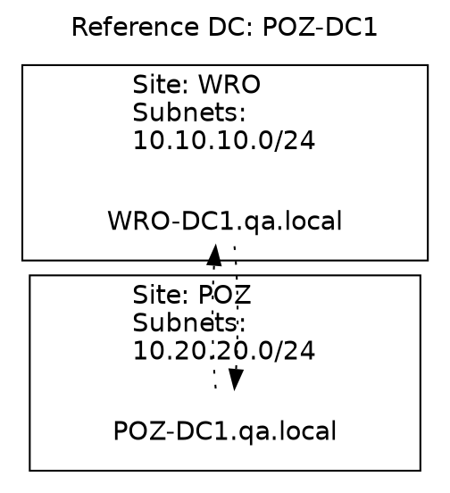

# Intro

If you have a look closer into [Active Directory Topology Visualization (part 1)](https://github.com/Grad1ent/ActiveDirectoryAndAround/tree/Active-Directory-Topology-Visualization-part-1) solution developed some time ago you will find that _vbs_ script queries one domain controller to find replication topology. It is quick approach to have overview of AD replication ASAP. However it represents viewpoint only of this domain controller and sometimes it doesn’t have to be objective true.

If domain controllers replicate each other without any issues and there isn’t any modification in numbers of them (adding, removing, etc.) topology looks the same on every DC and above solution is enough. But to have proper recognition of condition of AD environment during its modification there is needed something more comprehensive.

Here is my trial to find full overview of AD physical topology and condition of replication as a side effect of quering every domain controller in our environment. Below _vbs_ script queries all DCs found in AD, formats information about sites, servers and connection objects into _dot_ syntax and controls pictures of nodes (domain controllers) and labels of edges (connection objects) to report issues in topology like orphan or not accessible DCs or connection objects just generated and not seen by any other DC.

## Practice

_vbs_ script can be found [here](/files/getReplicationTopology.zip).

Usage:
```cmd
cscript /nologo getReplicationTopology.vbs
```

Example of _dot_ code generated by above _vbs_ script:


and diagram:

