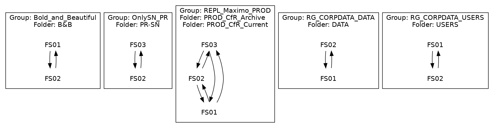

Topology of DFS-R can be easily visualized by using [GraphViz](http://graphviz.org) package.

Based on [Active Directory Topology Visualization (part 1)]() solution it's next script to have clear picture how DFS replication looks like. Design of solution is very the same: _vbs_ script queries AD regarding to DFS replication groups, folders, servers and connections and formats result into _dot_ syntax file. Then _dot_ file is used as input for _GraphViz_ package to generate picture of DFS-R topology.

_vbs_ script can be downloaded [here]()

Usage:

```cmd
cscript /nologo getDFSRTopology.vbs
```

Result:



and based on it here is the picture of DFR replication topology as result of the following command:
```cmd
fdp *.dot -Tjpg -O)
```

<p align="center">
   
</p>


