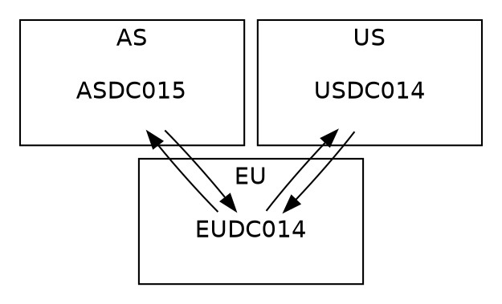

## Overview

Except of discontinued [Microsoft Active Directory Topology Diagrammer](http://www.microsoft.com/en-us/download/details.aspx?id=13380), which required licensed MS Visio installed, there is no easy way to show how physical topology of Active Directory looks like. As the Chinese proverb goes, “A picture is worth a thousand words”, result of 17
```
repadmin /replsum <DC>
```
commands even prepared in MS Excel will not tell as much as below screen:
<p align="center">
   
</p>

## Details

[GraphViz](http://www.graphviz.org/) is open-source tool based on dot language dedicated for drawing diagrams. It allows to present any graph or network in simple static form with information like direction of flow between nodes or node specific details. It is perfect tool to show how Active Directory Domain Controllers replicate each other and allows to find bottleneck or critical paths in AD physical topology.

Usage is very simple and requires GraphViz package installed locally and own developed script to prepare input for this tool based on dot language.

1. Below code is dot language script topology.dot used as input for GraphViz package to generate nice diagram:

note:
– AD Sites: EU, US and AS are specified as SUBGRAPH cluster_XX and are presented as rectangles in final diagram
– AD DCs: EUDC014, USDC014 and ASDC015 are simply nodes in diagram
– example of server picture to put into the same folder where topology.dot is located:
[]()

2. ...
