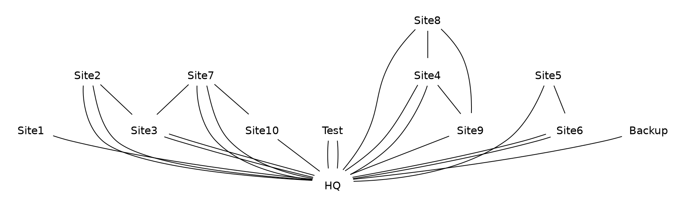

Based on solution developed for [Active Directory Topology Visualization (part 1)]() purpose I’ve made very similar script to have nice picture of defined site links in AD.

I think it’s quite good to know if gap in replication is not caused by lack of site link, etc.

Details:

Therre is queried via _vbs_ script the following DN:

```txt
CN=IP,CN=Inter-Site Transports,CN=Sites,CN=Configuration,DC=my,DC=domain
```

and result is presented in _dot_ syntax formatted file.

(_vbs_ script can be downloaded from [here](/files/getSiteLinks.zip)

Usage:

```cmd
cscript /nologo getSiteLinks.vbs
```

Gallery:

Result of above vbs script can look like as follow:



and based on it GraphViz can generate:

– dot diagram layout (command: dot *.dot -Tjpg -odot.jpg):
<p align="center">
   
</p>

– fdp diagram layout (command: fdp *.dot -Tjpg -ofdp.jpg):
<p align="center">
   
</p>

– sfdp diagram layout (command: sfdp *.dot -Tjpg -osfdp.jpg):
<p align="center">
   
</p>


Example of site node picture:
<p align="left">
   
</p>

There is possible to use any other picture to present site in diagram than above one. The most important is to put picture file of site (site.png in this case) in the same location where dot file is stored before compilation.
