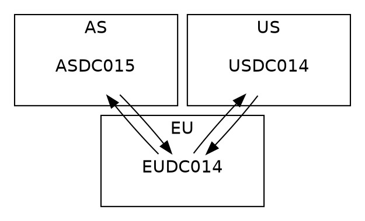

## Overview

Except of discontinued [Microsoft Active Directory Topology Diagrammer](http://www.microsoft.com/en-us/download/details.aspx?id=13380), which required licensed MS Visio installed, there is no easy way to show how physical topology of Active Directory looks like. As the Chinese proverb goes, “A picture is worth a thousand words”, result of couple
```
repadmin /replsum <DC>
```
commands will not tell as much as below screen:
<p align="center">
   
</p>

## Details

[GraphViz](http://www.graphviz.org/) is open-source tool based on _dot_ language dedicated for drawing diagrams. It allows to present any graph or network in simple static form with information like direction of flow between nodes or node specific details. It is perfect tool to show how Active Directory Domain Controllers replicate each other and allows to find bottleneck or critical paths in AD physical topology.

Usage is very simple and requires GraphViz package installed locally and own developed script to prepare input for this tool based on dot language.

1. Below code is dot language script topology.dot used as input for GraphViz package to generate nice diagram:

Note:
* AD Sites: EU, US and AS are specified as SUBGRAPH cluster_XX and are presented as rectangles in final diagram
* AD DCs: EUDC014, USDC014 and ASDC015 are simply nodes in diagram
* example of server picture to put into the same folder where topology.dot is located:
<p align="left">
   
</p>

2. Command to generate picture of dot diagram layout:
```cmd
dot topology.dot -Tjpg -O
```
and result:
<p align="center">
   
</p>

3. Examples of commands to generate all kind of diagram layouts:
``` cmd
dot *.dot -Tjpg -odot.jpg
fdp *.dot -Tjpg -ofdp.jpg
sfdp *.dot -Tjpg -osfdp.jpg
circo *.dot -Tjpg -ocirco.jpg
neato *.dot -Tjpg -oneato.jpg
osage *.dot -Tjpg -oosage.jpg
twopi *.dot -Tjpg -otwopi.jpg
```

## Practice

Dot file can be prepared manually or a bit smarter. Below vbs is my own developed and many time used script which queries AD regarding to sites, domain controllers and connection objects and generates dot launguage file used later in GraphViz package.

Vbs script is available to download [here](/files/getReplicationTopologyLite.zip) and feel free to use it:
```cmd
cscript /nologo getReplicationTopologyLite.vbs DC
```

## Gallery

Below diagrams are examples of AD replication topology:
<p align="center">
   
</p>

<p align="center">
   
</p>

However more complex environments (>100 DCs) require a few tricks to make pictures more readable. I usually add dotted style for connections for example:
```dot
DIGRAPH replicationTopology {
 
    fontname=helvetica;
    node [fontname=helvetica, image="server.png", labelloc=b,color=white];
    edge [style=dotted];
    ...
```
or trying to generate all kind of diagram layouts to choose the most suitable to study. In most cases huge networks need specific approach.

## A few useful links

* [Official GraphViz web site](http://www.graphviz.org)
* [Dot guide](http://www.graphviz.org/pdf/dotguide.pdf)
* [Wikipedia about GraphViz](http://en.wikipedia.org/wiki/Graphviz)
* [Active Directory Topology Visualization part 2](https://github.com/Grad1ent/ActiveDirectoryAndAround/tree/Active-Directory-Topology-Visualization-part-2)


Let the “more readable replication topology” be with you.
