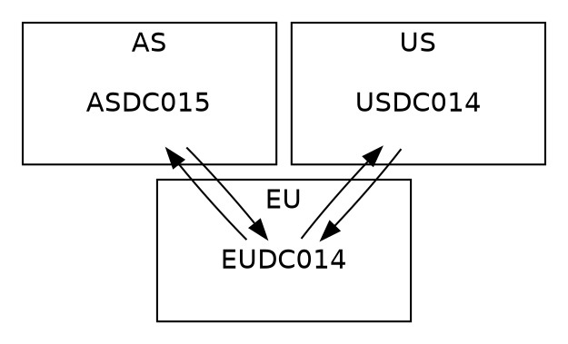

## Overview

Except of discontinued [Microsoft Active Directory Topology Diagrammer](http://www.microsoft.com/en-us/download/details.aspx?id=13380), which required MS Visio installed, there is no easy way to show how physical topology of Active Directory looks like. As the Chinese proverb goes, “A picture is worth a thousand words”, result of couple
```
repadmin /replsum <DC>
```
commands will not tell as much as the following screen:
<p align="center">
   
</p>

## Details

[GraphViz](http://www.graphviz.org/) is open-source tool based on _dot_ language dedicated for drawing diagrams. It allows to present any graph or network in simple static form with information like direction of flow between nodes or node specific details. It is promissing tool to show how Active Directory Domain Controllers replicate each other and helps to find bottleneck or critical paths in AD physical topology.

Usage is very simple and requires _GraphViz_ package installed locally and own developed script to prepare input based on _dot_ language syntax.

1. Below code can be stored in _*.dot_ srtipt and can be used as an input for _GraphViz_ package to generate nice diagram:

Note:
* _EU_, _US_ and _AS_ specified as _SUBGRAPH_ _cluster_XX_ show AD Sites and are presented as rectangles in final diagram
* _EUDC014_, _USDC014_ and _ASDC015_ are nodes in diagram and represent AD DCs
* example of server picture to put into the same folder where _*.dot_ sript is located:
<p align="left">
   
</p>

2. Command to generate diagram using _dot_ layout:
```cmd
dot topology.dot -Tjpg -O
```
and result:
<p align="center">
   
</p>

3. Examples of commands to generate diagrams with all kind of layouts:
``` cmd
dot *.dot -Tjpg -odot.jpg
fdp *.dot -Tjpg -ofdp.jpg
sfdp *.dot -Tjpg -osfdp.jpg
circo *.dot -Tjpg -ocirco.jpg
neato *.dot -Tjpg -oneato.jpg
osage *.dot -Tjpg -oosage.jpg
twopi *.dot -Tjpg -otwopi.jpg
```

## Practice

_Dot_ script can be prepared manually or a bit smarter. Below _vbs_ script queries AD to find details about sites, domain controllers and connection objects and generates _dot_ script used later with _GraphViz_ package.

_Vbs_ script is available to download [here](/files/getReplicationTopologyLite.zip).

Usage:
```cmd
cscript /nologo getReplicationTopologyLite.vbs DC
```

## Gallery

Below diagrams are examples of AD replication topologies generated automaticaly:
<p align="center">
   
</p>

<p align="center">
   
</p>

More complex environments (>100 DCs) require a few tricks to make pictures more readable. Adding dotted style edges
```dot
DIGRAPH replicationTopology {
 
    fontname=helvetica;
    node [fontname=helvetica, image="server.png", labelloc=b,color=white];
    edge [style=dotted];
    ...
```
or trying to generate diagrams using all kind of layouts help to choose the most suitable topology picture to study. In most cases huge networks require specific approach.

## References

[Official GraphViz web site](http://www.graphviz.org)

[Dot guide](http://www.graphviz.org/pdf/dotguide.pdf)

[Wikipedia about GraphViz](http://en.wikipedia.org/wiki/Graphviz)

[Active Directory Topology Visualization part 2](https://github.com/Grad1ent/ActiveDirectoryAndAround/tree/Active-Directory-Topology-Visualization-part-2)
